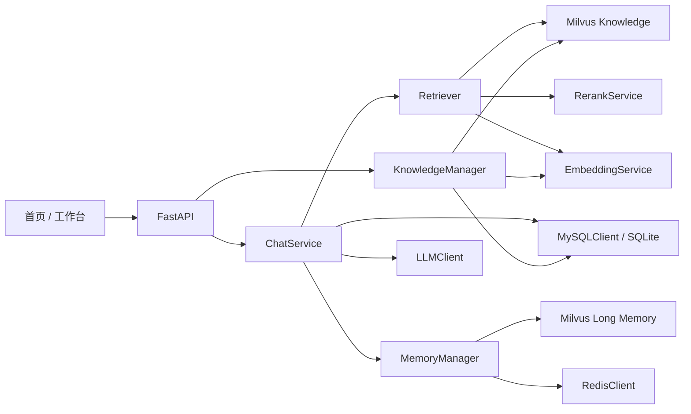
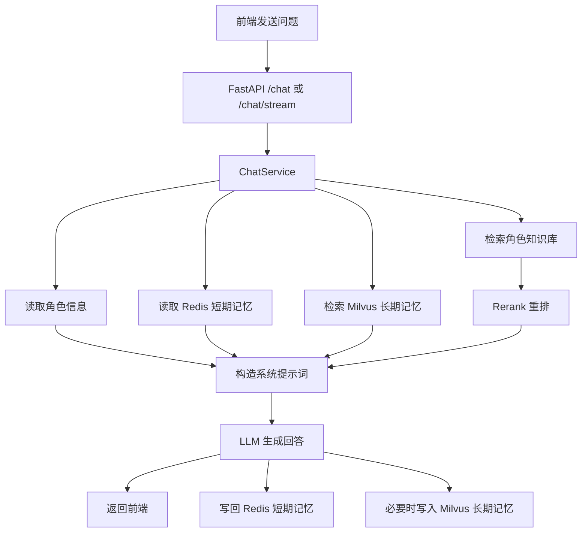
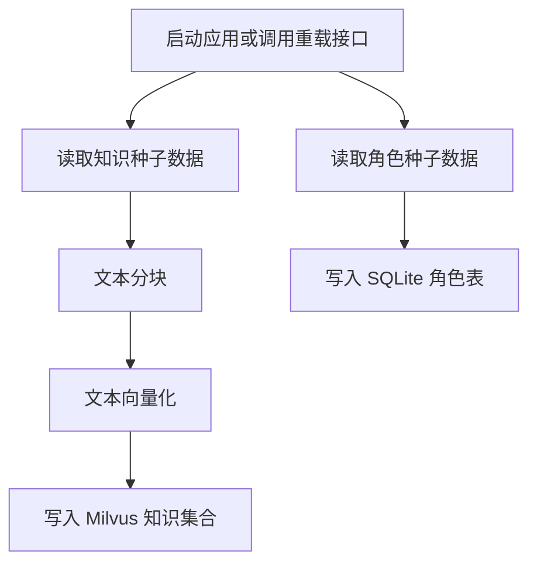

# 设计文档

## 1. 项目概述

本项目是一个基于 RAG 的角色扮演式对话系统，目标是在本地开发环境中实现“角色对话 + 短期记忆 + 长期记忆 + 知识检索 + 大模型生成”的完整链路。

当前版本已经具备以下特征：

- 后端采用 FastAPI，提供页面访问和 API 接口
- 前端采用静态 HTML + CSS + JavaScript，包含首页和工作台两个页面
- 用户与角色基础信息由 SQLite 持久化存储
- 短期对话记忆优先写入 Redis
- 角色知识库与长期记忆优先写入 Milvus
- 大模型调用兼容 OpenAI 风格接口，当前通过 SiliconFlow 接入
- 提供一键启动脚本，自动检查并拉起 Redis、Milvus 和应用服务

## 2. 设计目标

- 支持多角色、多会话的角色扮演式问答
- 支持基于角色知识库的检索增强生成
- 支持短期记忆与长期记忆分层管理
- 支持本地开发运行，并为后续真实部署预留清晰边界
- 保持模块职责清晰，便于后续替换 Embedding、Rerank、LLM、Redis、Milvus 等组件

## 3. 技术栈

- Web 框架：FastAPI
- 应用服务：Uvicorn
- 数据模型：Pydantic
- 短期记忆：Redis
- 向量数据库：Milvus
- 用户/角色存储：SQLite
- 向量化：HashingVectorizer
- 重排序：启发式 Rerank
- 大模型接口：OpenAI Compatible API
- 前端：原生 HTML / CSS / JavaScript
- 容器环境：Docker + WSL

## 4. 总体架构



## 5. 项目目录结构

```text
RAG/
│
├── main.py                         # FastAPI 主入口
├── config.py                       # 配置中心，读取 .env
├── requirements.txt                # Python 依赖
├── .env                            # 运行配置
├── start-stack.ps1                 # 一键启动 PowerShell 脚本
├── start-stack.cmd                 # Windows 双击入口
├── docker-compose.milvus.yml       # Milvus 容器编排
│
├── database/
│   ├── mysql_client.py             # 用户、角色数据访问层，当前实际落地 SQLite
│   ├── redis_client.py             # 短期记忆存储层
│   └── milvus_client.py            # 知识库与长期记忆向量存储层
│
├── core/
│   ├── embedding.py                # 文本向量化
│   ├── rerank.py                   # 检索结果重排序
│   ├── retriever.py                # 检索器
│   └── llm_client.py               # 大模型调用
│
├── modules/
│   ├── chat.py                     # 对话总编排
│   ├── memory.py                   # 记忆管理
│   ├── knowledge.py                # 知识库管理
│   └── role_prompts.py             # 角色提示词拼装
│
├── models/
│   └── schemas.py                  # 数据模型定义
│
├── frontend/
│   ├── index.html                  # 首页
│   ├── workspace.html              # 工作台
│   └── static/
│       ├── home.js                 # 首页脚本
│       ├── workspace.js            # 工作台脚本
│       ├── styles.css              # 样式文件
│       └── favicon.svg             # 站点图标
│
├── utils/
│   ├── logger.py                   # 日志工具
│   ├── text_splitter.py            # 文本切块
│   └── text_sanitizer.py           # 文本清洗与乱码过滤
│
├── scripts/
│   ├── init_mysql.py               # 初始化数据库
│   ├── init_milvus.py              # 初始化 Milvus
│   └── load_demo_data.py           # 加载演示数据
│
├── data/
│   ├── seed/
│   │   ├── roles.json              # 角色种子数据
│   │   ├── knowledge_documents.json# 知识种子数据
│   │   └── eval_dataset.json       # 评测数据
│   └── storage/
│       ├── app.db                  # SQLite 数据库
│       ├── redis_store.json        # Redis 降级存储
│       ├── milvus_store.json       # Milvus 降级存储
│       └── demo_seed_version.txt   # 种子版本标记
│
├── logs/
│   └── app.log                     # 运行日志
│
├── tests/
│   ├── test_chat.py                # 对话测试
│   └── test_api.py                 # API 测试
│
├── evaluation/
│   └── ragas_eval.py               # RAG 评测
│
├── stress_test/
│   └── stress_test.py              # 压力测试
│
└── docs/
    ├── api_documentation.md        # 接口文档
    ├── design.md                   # 设计文档
    └── requirements_spec.md        # 需求文档
```

## 6. 核心模块设计

### 6.1 接口层

`main.py` 是系统主入口，负责：

- 创建 FastAPI 应用
- 初始化数据库结构和演示知识库
- 提供首页与工作台页面访问
- 暴露健康检查、角色列表、用户创建、聊天、历史记录、知识重载等接口

主要接口包括：

- `GET /`
- `GET /workspace`
- `GET /health`
- `GET /roles`
- `POST /users`
- `POST /chat`
- `POST /chat/stream`
- `GET /sessions/{session_id}/history`
- `POST /knowledge/reload`

### 6.2 数据访问层

#### `database/mysql_client.py`

职责：

- 保存用户信息
- 保存角色信息
- 提供角色查询、角色列表、用户创建能力

说明：

- 类名保留为 `MySQLClient`
- 当前实际实现使用 SQLite
- 这种设计保留了未来替换为真实 MySQL 的边界

#### `database/redis_client.py`

职责：

- 管理短期对话记忆
- 按 `session_id` 存储当前会话消息列表

实现策略：

- 优先连接真实 Redis
- 如果 Redis 不可用，则自动降级到本地 JSON 文件

当前状态：

- 已接入真实 Redis
- 当前运行模式为 `redis`

#### `database/milvus_client.py`

职责：

- 管理角色知识库向量集合
- 管理长期记忆向量集合
- 提供向量写入、检索、集合初始化、重建等能力

实现策略：

- 优先连接真实 Milvus
- 如果 Milvus 不可用，则自动降级到本地 JSON 文件

当前状态：

- 已接入真实 Milvus
- 当前运行模式为 `milvus`

### 6.3 RAG 核心层

#### `core/embedding.py`

职责：

- 将文本转换为向量

当前实现：

- 使用 `HashingVectorizer`
- 适合 CPU 环境
- 启动成本低，方便本地开发验证完整链路

说明：

- 配置中保留了 `BGE-M3` 的接口位
- 后续可以替换为真实 Embedding 模型实现

#### `core/retriever.py`

职责：

- 根据用户问题构造多个检索查询变体
- 调用向量库检索候选知识片段
- 合并多轮候选
- 交给 Rerank 模块重排
- 输出最终引用片段

当前策略：

- 角色过滤检索
- 查询改写
- 混合打分
- 去重过滤

#### `core/rerank.py`

职责：

- 对召回结果进行二次排序

当前实现：

- 基于词重叠、标题重叠、短语匹配和原始分数的启发式重排

说明：

- 保留了未来替换 `BGE-Reranker` 的边界

#### `core/llm_client.py`

职责：

- 调用上游大模型生成回复
- 支持普通生成和流式生成
- 对异常内容和乱码内容进行兜底处理

当前能力：

- 支持 OpenAI 兼容接口
- 支持 `mock` 模式
- 支持流式输出
- 支持回答后文本清洗

### 6.4 业务层

#### `modules/chat.py`

职责：

- 组织一轮完整对话流程
- 读取角色信息
- 读取短期记忆
- 检索长期记忆
- 检索知识库引用
- 构造系统提示词
- 调用 LLM
- 回写短期记忆与长期记忆

它是整个系统的核心编排器。

#### `modules/memory.py`

职责：

- 读取短期记忆
- 写入当前轮对话
- 根据规则抽取长期记忆
- 检索用户长期记忆

当前设计：

- 短期记忆写入 Redis
- 长期记忆写入 Milvus
- 对明显乱码文本进行过滤

#### `modules/knowledge.py`

职责：

- 加载角色种子数据
- 加载知识文档种子数据
- 对知识文档分块
- 生成向量
- 写入知识库集合

说明：

- 启动时自动检查是否需要初始化
- 支持通过接口重新加载知识库

#### `modules/role_prompts.py`

职责：

- 按角色模板组装系统提示词
- 将角色设定、短期记忆、长期记忆、知识引用统一拼装为大模型上下文

## 7. 前端架构

前端采用双页面结构：

- `index.html`：首页，负责系统概览和进入工作台
- `workspace.html`：工作台，负责登录、角色切换、会话管理、流式对话

`workspace.js` 负责以下交互：

- 游客或具名登录
- 拉取角色列表
- 点击角色自动新建会话
- 维护本地会话列表
- 调用流式聊天接口
- 渲染消息与知识引用
- 拉取健康状态

前端本地状态主要保存在浏览器 `localStorage` 中，用于保存：

- 当前用户
- 当前选中的角色
- 当前会话 ID
- 会话列表摘要

## 8. 数据流设计

### 8.1 对话主流程



### 8.2 知识库初始化流程



## 9. 存储设计

### 9.1 SQLite

当前用于保存：

- 用户信息
- 角色信息

对应文件：

- `data/storage/app.db`

### 9.2 Redis

当前用于保存：

- 短期会话消息

存储粒度：

- 每个 `session_id` 对应一个消息列表

优势：

- 读写快
- 适合保存最近若干轮上下文

### 9.3 Milvus

当前用于保存：

- 角色知识库集合
- 用户长期记忆集合

集合划分：

- `role_knowledge`
- `user_long_memory`

优势：

- 支持向量检索
- 适合做知识召回和偏好召回

## 10. 配置设计

系统通过 `.env` 统一配置，关键项包括：

- `APP_PORT`
- `PYTHON_EXE`
- `LLM_PROVIDER`
- `LLM_MODEL_NAME`
- `LLM_API_BASE`
- `LLM_API_KEY`
- `REDIS_ENABLED`
- `REDIS_HOST`
- `REDIS_PORT`
- `REDIS_DB`
- `MILVUS_ENABLED`
- `MILVUS_URI`
- `MILVUS_TOKEN`

当前实际运行中：

- Redis 已启用
- Milvus 已启用
- 应用主端口配置为 `8001`

## 11. 启动与部署设计

### 11.1 启动方式

当前项目支持通过以下方式启动：

- 运行 `start-stack.cmd`
- 或运行 `start-stack.ps1`

脚本会自动完成：

- 检查 Redis 端口是否可用
- 检查 Milvus 端口是否可用
- 必要时通过 WSL 调用 Docker 启动容器
- 检查应用是否启动
- 输出工作台访问地址

### 11.2 当前部署形态

当前属于本地开发部署：

- Windows 作为主机环境
- WSL Ubuntu 作为 Linux 子环境
- Docker 运行在 WSL 中
- Milvus 与 Redis 运行在 Docker 容器中
- FastAPI 应用运行在 Windows 项目环境中

## 12. 日志设计

日志文件：

- `logs/app.log`

当前已记录的信息包括：

- Redis 连接成功
- Milvus 连接成功
- Collection 初始化与加载
- 知识块写入
- 长期记忆写入
- 检索命中情况

作用：

- 便于判断当前是否真正使用了 Redis 和 Milvus
- 便于排查连接失败、写入失败、检索异常等问题

## 13. 当前实现特点与局限

### 13.1 当前优点

- 模块边界清晰
- 本地环境可稳定运行
- Redis 与 Milvus 已真实接入
- 具备完整的 RAG 问答链路
- 支持多角色、多会话、流式回答

### 13.2 当前局限

- `MySQLClient` 当前实际使用的是 SQLite，不是真实 MySQL
- Embedding 当前还是轻量向量化方案，不是真实 BGE-M3
- Rerank 当前是启发式规则，不是真实 BGE-Reranker
- 前端部分文案和静态内容仍有进一步统一空间
- 长期记忆抽取规则目前较简单，主要基于关键词触发

### 13.3 为什么当前版本没有一开始就全部采用标准化方案

当前版本采用的是“先跑通完整链路，再逐步替换为标准实现”的策略，而不是一开始就把所有模块都升级到最终形态。这样设计主要出于以下考虑：

- 第一阶段的核心目标是先验证系统闭环是否成立，即页面、接口、记忆、检索、生成和存储是否能够稳定协同工作
- 本地开发环境同时涉及 Windows、WSL、Docker、Redis、Milvus 和外部 LLM API，如果再一开始叠加真实 Embedding、真实 Rerank 和更重的数据库部署，启动和排错成本会明显增加
- 轻量实现可以先验证架构边界是否正确，例如 Embedding、Rerank、向量库和关系型存储是否已经被清晰解耦
- 先完成“可运行、可演示、可排错”的版本，再逐步替换为更标准的组件，能显著降低开发风险
- 对当前设备条件而言，工程标准化和存储标准化通常比模型标准化更容易落地，因此升级需要分阶段推进

## 14. 后续优化建议

### 14.1 总体升级原则

后续升级建议遵循“先工程标准化，再模型标准化”的顺序。原因是工程层和存储层升级对机器算力要求较低，但能显著提升稳定性、可维护性和可扩展性；而真实 Embedding 与真实 Rerank 的引入会明显增加本地资源压力，需要在链路稳定之后谨慎推进。

### 14.2 更现实的升级路线

#### 第一阶段：优先完成工程与存储标准化

- 将 SQLite 替换为真实 MySQL
- 优化前端文案与静态内容一致性
- 丰富长期记忆提取规则
- 引入更强的 Query Rewrite 与 Recall 策略
- 补充管理后台与更细粒度日志
- 增加更完整的测试与评测指标

这一阶段主要提升工程规范性、稳定性和可维护性，通常不显著增加本地算力负担。

#### 第二阶段：优化检索与记忆策略

- 优化查询改写逻辑
- 优化候选召回与过滤策略
- 改善多轮对话中的上下文利用方式
- 调整长期记忆写入与召回规则

这一阶段重点在效果优化，仍然以策略升级为主，适合本地持续迭代。

#### 第三阶段：谨慎接入真实 Embedding

- 将 Embedding 替换为真实 BGE-M3
- 先在小规模知识库和单用户场景下测试
- 观察内存占用、启动时间和响应时延

这一阶段开始明显增加资源消耗，是否长期保留在本机运行，需要根据设备内存、CPU 和使用体验再做判断。

#### 第四阶段：最后接入真实 Rerank

- 将 Rerank 替换为真实 BGE-Reranker
- 在 Embedding 已稳定运行的前提下再引入

因为 Rerank 会进一步增加推理成本，所以应作为靠后的升级项处理。

### 14.3 设备适配结论

从当前机器条件出发，更现实的结论是：

- 工程标准化：通常可以较稳定落地
- 存储标准化：通常可以较稳定落地
- 模型标准化：可以尝试，但不一定适合长期本地常驻运行

因此，推荐优先完成数据库、日志、检索策略、前端和测试层面的升级，再视设备承受能力决定是否本地接入真实 BGE-M3 与 BGE-Reranker。

### 14.4 本机升级建议

如果目标是把当前项目逐步升级到更标准的版本，可以按下面的方式理解本机承载能力：

- `Redis + Milvus + FastAPI + 外部 LLM API` 这一层，当前机器通常可以继续稳定承载
- `MySQL` 替换 `SQLite` 这一层，对本机压力通常不大，更多增加的是部署和维护复杂度，不是算力压力
- 真实 `BGE-M3` 本地推理，会明显增加内存占用、启动时间和检索前处理成本
- 真实 `BGE-Reranker` 本地推理，会在每轮检索后继续增加推理耗时，通常比当前启发式重排更吃资源

更直接地说：

- 如果你的目标是“项目更规范、更像标准工程”，当前电脑通常可以支持
- 如果你的目标是“所有模型都本地标准化部署并长期流畅运行”，则不应直接默认当前电脑一定合适

建议按配置理解风险：

- `16GB` 内存及以下：适合继续保持当前方案，或只做工程层升级，不建议一开始就同时本地接入真实 Embedding 和真实 Rerank
- `32GB` 内存左右：可以尝试小规模接入真实 Embedding，但仍建议分阶段测试，不建议一次性全部替换
- 有独立显卡且显存较充足：更适合进一步尝试真实 Embedding 和真实 Rerank，本地体验会更稳定
- 仅普通 CPU 环境：可以做真实模型验证，但更适合作为实验用途，不一定适合长期高频使用

因此，对当前项目最稳妥的建议是：

1. 先完成工程标准化和存储标准化。
2. 再小范围测试真实 `BGE-M3`。
3. 最后再决定是否需要真实 `BGE-Reranker`。

这样做的改善在于：

- 先把系统稳定性、可维护性和可排障能力做扎实
- 避免把“代码问题”和“机器算力问题”混在一起
- 降低一次性升级过多组件导致整体系统变慢或难以定位故障的风险

## 15. 总结

本项目当前已经形成一套可运行的角色扮演式 RAG 系统架构：

- 前端负责角色入口、会话管理和消息交互
- FastAPI 负责接口编排和页面服务
- Redis 负责短期记忆
- Milvus 负责知识库与长期记忆
- SQLite 负责用户和角色基础信息
- LLM 负责最终回答生成

从工程角度看，这套结构已经具备继续扩展到更真实、更完整生产化架构的基础。
