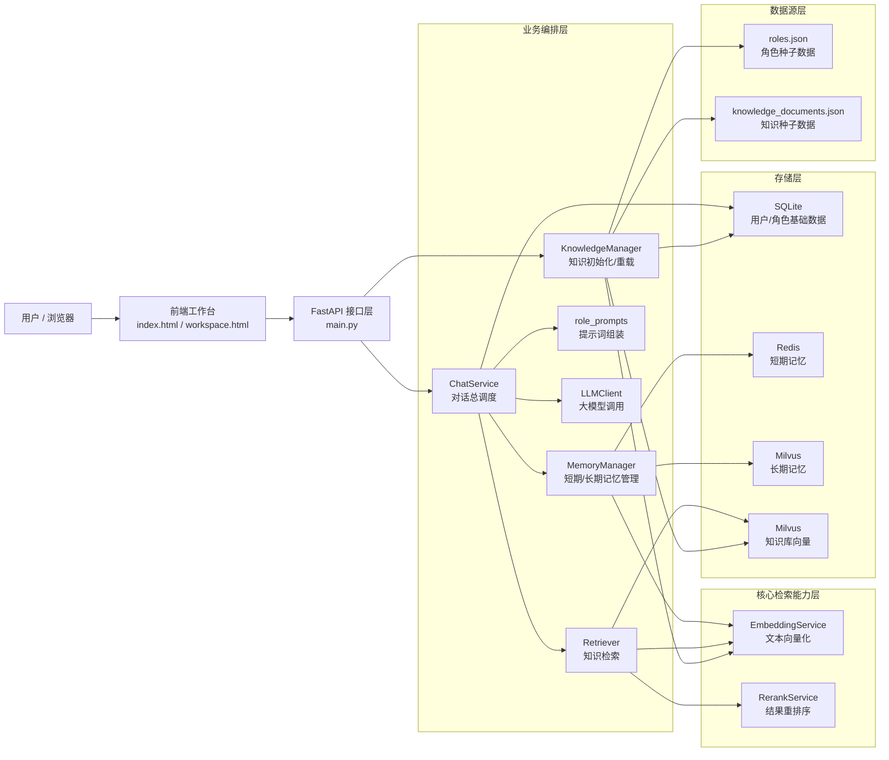
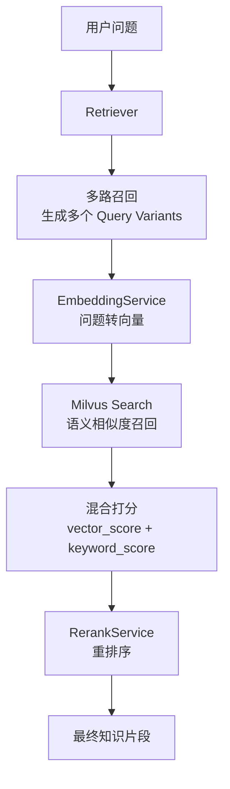
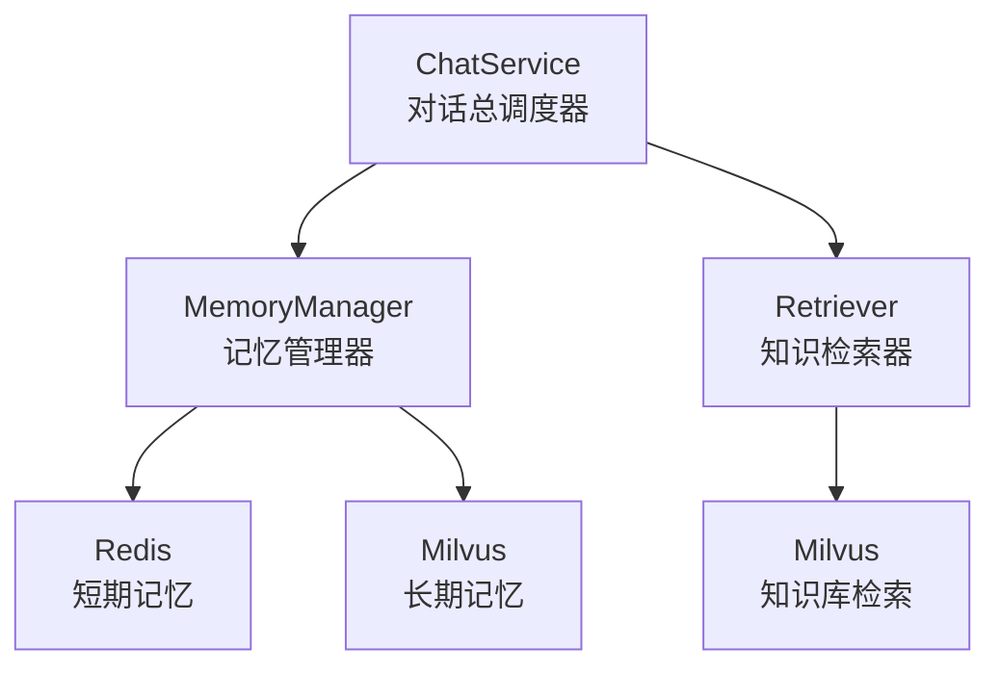

# RAG 架构图（Mermaid）

## 总体架构图

```mermaid
flowchart LR
    U[用户 / 浏览器]
    FE[前端工作台<br/>index.html / workspace.html]
    API[FastAPI 接口层<br/>main.py]

    subgraph APP[业务编排层]
        CHAT[ChatService<br/>对话总调度]
        MEM[MemoryManager<br/>短期/长期记忆管理]
        RET[Retriever<br/>知识检索]
        PROMPT[role_prompts<br/>提示词组装]
        LLM[LLMClient<br/>大模型调用]
        KNOW[KnowledgeManager<br/>知识初始化/重载]
    end

    subgraph CORE[核心检索能力层]
        EMB[EmbeddingService<br/>文本向量化]
        RERANK[RerankService<br/>结果重排序]
    end

    subgraph STORAGE[存储层]
        SQL[SQLite<br/>用户/角色基础数据]
        REDIS[Redis<br/>短期记忆]
        MILVUS1[Milvus<br/>长期记忆]
        MILVUS2[Milvus<br/>知识库向量]
    end

    subgraph DATA[数据源层]
        ROLES[roles.json<br/>角色种子数据]
        DOCS[knowledge_documents.json<br/>知识种子数据]
    end

    U --> FE
    FE --> API

    API --> CHAT
    API --> KNOW

    CHAT --> MEM
    CHAT --> RET
    CHAT --> PROMPT
    CHAT --> LLM
    CHAT --> SQL

    MEM --> REDIS
    MEM --> EMB
    MEM --> MILVUS1

    RET --> EMB
    RET --> MILVUS2
    RET --> RERANK

    KNOW --> ROLES
    KNOW --> DOCS
    KNOW --> SQL
    KNOW --> EMB
    KNOW --> MILVUS2
```

## 检索流程图

```mermaid
flowchart TD
    Q[用户问题]
    RV[Retriever]
    VAR[多路召回<br/>生成多个 Query Variants]
    EMB[EmbeddingService<br/>问题转向量]
    VDB[Milvus Search<br/>语义相似度召回]
    SCORE[混合打分<br/>vector_score + keyword_score]
    RR[RerankService<br/>重排序]
    OUT[最终知识片段]

    Q --> RV
    RV --> VAR
    VAR --> EMB
    EMB --> VDB
    VDB --> SCORE
    SCORE --> RR
    RR --> OUT
```

## 记忆与检索关系图

```mermaid
flowchart TD
    CS[ChatService<br/>对话总调度器]
    MM[MemoryManager<br/>记忆管理器]
    RT[Retriever<br/>知识检索器]
    RS[Redis<br/>短期记忆]
    ML[Milvus<br/>长期记忆]
    MK[Milvus<br/>知识库检索]

    CS --> MM
    CS --> RT

    MM --> RS
    MM --> ML

    RT --> MK
```
