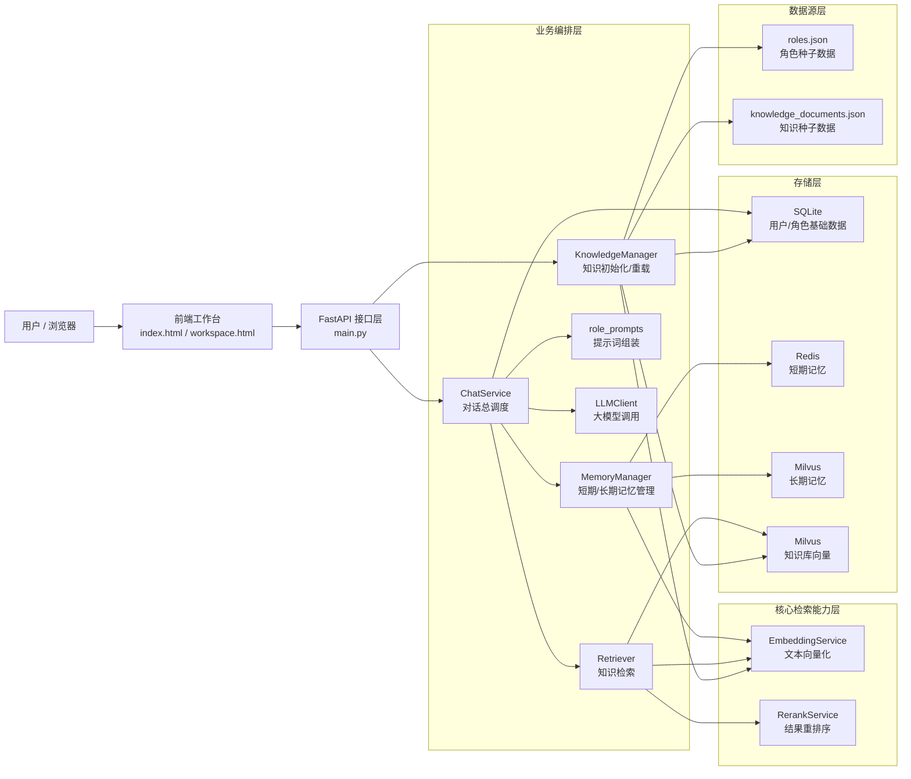
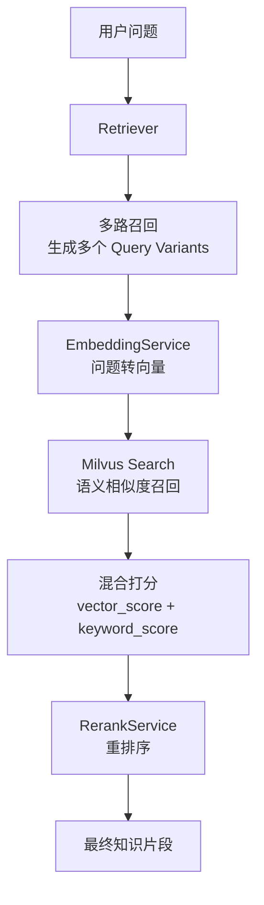
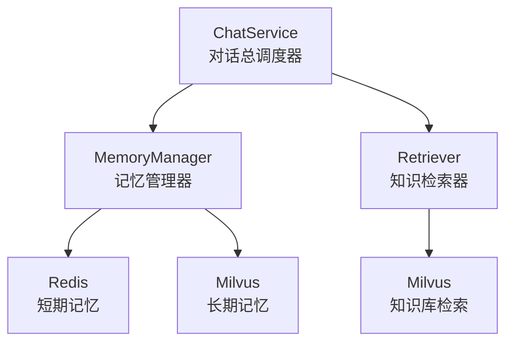

# RAG 系统架构图（汇报版）

这份文档提供两种内容：

- `Mermaid` 架构图：适合放到 Markdown、文档、汇报材料中展示
- `XMind` 导图大纲：适合导入 XMind 做脑图展示

## 使用建议

基于 XMind 官方帮助中心，当前可以稳定依赖的是 `Markdown 导入`。我没有查到官方明确说明 XMind 原生渲染 `Mermaid` 的能力，所以稳妥做法是：

- 用下面的 `Mermaid` 图做展示图
- 用下面的 `XMind 导图大纲` 或已有的 `OPML` 文件做脑图导入

参考：

- XMind 帮助中心的“如何将 Markdown 文件导入到 XMind？”入口：<https://xmind.cn/help/using-xmind>
- XMind 官方更新页：<https://xmind.cn/changelog>

---

## 1. 领导汇报版 Mermaid 架构图

这张图按“用户请求如何流经系统”来画，重点突出层次、职责和数据流。

---

## 2. 检索能力 Mermaid 图

这张图专门讲你当前项目里的“多路召回 + 语义相似度检索 + 混合检索 + 重排序”。

---

## 3. 记忆与检索关系 Mermaid 图

这张图专门回答“Milvus 在项目里做什么”“MemoryManager 和 Retriever 的边界是什么”。

---

## 4. XMind 导图大纲

这部分直接适合导入 XMind 或复制成脑图结构。

- RAG 对话系统架构
  - 1. 项目目标
    - 角色化问答
    - 检索增强生成
    - 短期记忆与长期记忆协同
    - 支持多会话与流式回复
  - 2. 总体架构
    - 用户层
      - 浏览器
      - 工作台页面
    - 接口层
      - FastAPI
      - `/chat`
      - `/chat/stream`
      - `/roles`
      - `/sessions/{session_id}/history`
    - 业务编排层
      - ChatService
      - MemoryManager
      - Retriever
      - KnowledgeManager
      - role_prompts
      - LLMClient
    - 核心能力层
      - EmbeddingService
      - RerankService
    - 存储层
      - SQLite
      - Redis
      - Milvus 长期记忆
      - Milvus 知识库
    - 数据源层
      - roles.json
      - knowledge_documents.json
  - 3. 核心流程
    - 用户发起问题
    - 接口层接收请求
    - 读取角色信息
    - 读取短期记忆
    - 检索长期记忆
    - 检索知识库
    - 组装提示词
    - 调用大模型
    - 写回记忆
    - 返回前端
  - 4. 检索能力
    - 多路召回
      - 生成多个 query variants
      - 分别召回候选结果
      - 合并去重
    - 语义相似度检索
      - 文本向量化
      - Milvus 向量召回
    - 混合检索
      - 向量分
      - 关键词分
      - 混合打分
    - 重排序
      - 词重叠
      - 标题重叠
      - 短语匹配
  - 5. 记忆体系
    - 短期记忆
      - Redis
      - 按 session_id 管理
    - 长期记忆
      - Milvus
      - 按 user_id 检索
  - 6. 业务价值
    - 提升回答准确性
    - 提升上下文连续性
    - 提升角色沉浸感
    - 提升系统扩展性
  - 7. 当前实现特点
    - FastAPI 后端
    - Redis 短期记忆
    - Milvus 向量检索
    - 轻量 Embedding
    - 启发式 Rerank
    - OpenAI Compatible LLM 接口
  - 8. 后续优化方向
    - MySQL 替换 SQLite
    - 更强 Embedding
    - 更强 Rerank
    - 更完善日志与监控
    - 更完整评测体系

---

## 5. 汇报话术

如果你只讲 1 分钟，建议用这一版：

- 系统整体分为接口层、业务编排层、核心能力层、存储层和数据源层。
- 用户问题进入后，系统会先读取角色信息、短期记忆和长期记忆，再通过检索模块完成多路召回、语义相似度检索、混合打分和重排序。
- 最终系统把角色设定、记忆和知识片段组装成提示词，交给大模型生成回答，并把结果写回记忆系统。

如果你只讲一句话，建议用这一版：

- 这套系统通过“角色设定 + 记忆管理 + 多路召回 + 混合检索 + 大模型生成”实现了一个完整的 RAG 对话闭环。
