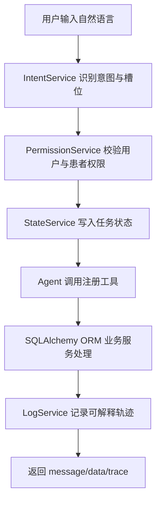
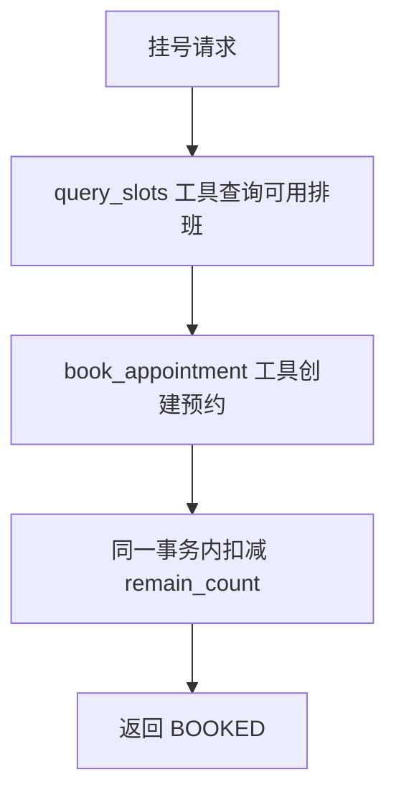
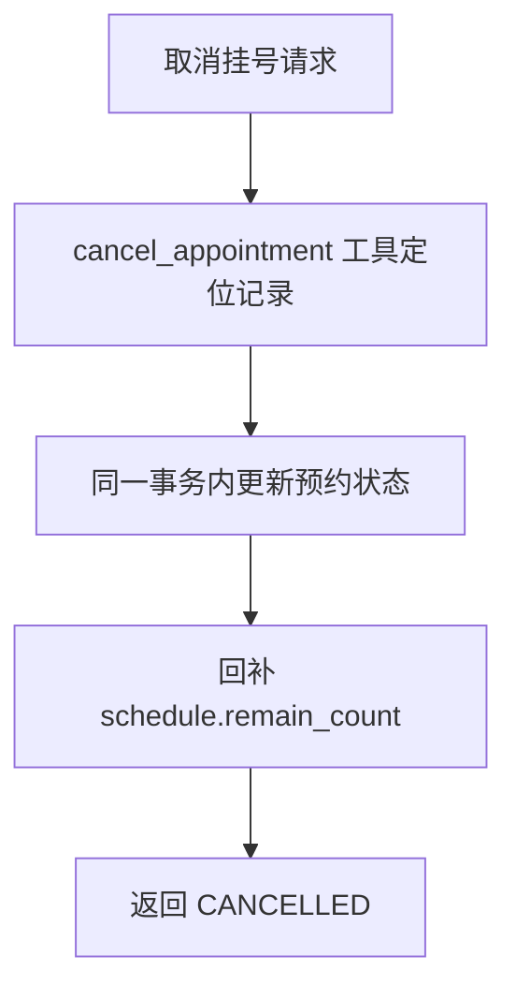
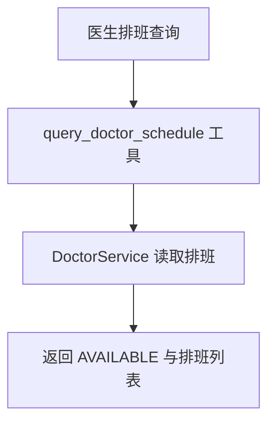

# 业务流程

```mermaid
flowchart TD
    A["用户输入自然语言"] --> B["IntentService 识别意图与槽位"]
    B --> C["PermissionService 校验用户与患者权限"]
    C --> D["StateService 写入任务状态"]
    D --> E["Agent 调用注册工具"]
    E --> F["SQLAlchemy ORM 业务服务处理"]
    F --> G["LogService 记录可解释轨迹"]
    G --> H["返回 message/data/trace"]
```

```mermaid
flowchart TD
    A["挂号请求"] --> B["query_slots 工具查询可用排班"]
    B --> C["book_appointment 工具创建预约"]
    C --> D["同一事务内扣减 remain_count"]
    D --> E["返回 BOOKED"]
```

```mermaid
flowchart TD
    A["取消挂号请求"] --> B["cancel_appointment 工具定位记录"]
    B --> C["同一事务内更新预约状态"]
    C --> D["回补 schedule.remain_count"]
    D --> E["返回 CANCELLED"]
```

```mermaid
flowchart TD
    A["医生排班查询"] --> B["query_doctor_schedule 工具"]
    B --> C["DoctorService 读取排班"]
    C --> D["返回 AVAILABLE 与排班列表"]
```
