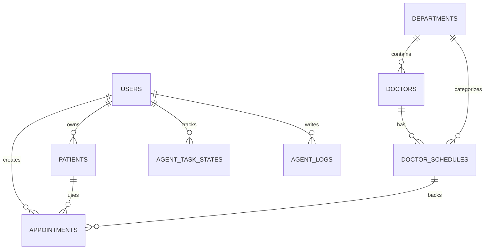

# ER 图

```mermaid
erDiagram
    USERS ||--o{ PATIENTS : owns
    USERS ||--o{ APPOINTMENTS : creates
    PATIENTS ||--o{ APPOINTMENTS : uses
    DEPARTMENTS ||--o{ DOCTORS : contains
    DOCTORS ||--o{ DOCTOR_SCHEDULES : has
    DEPARTMENTS ||--o{ DOCTOR_SCHEDULES : categorizes
    DOCTOR_SCHEDULES ||--o{ APPOINTMENTS : backs
    USERS ||--o{ AGENT_TASK_STATES : tracks
    USERS ||--o{ AGENT_LOGS : writes
```
